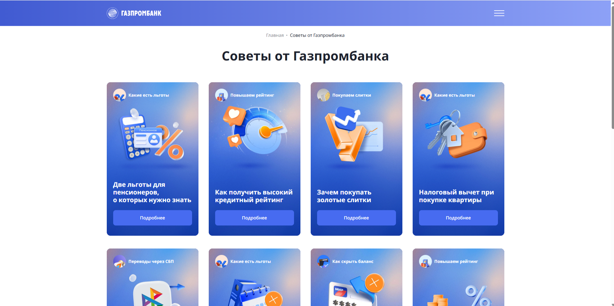
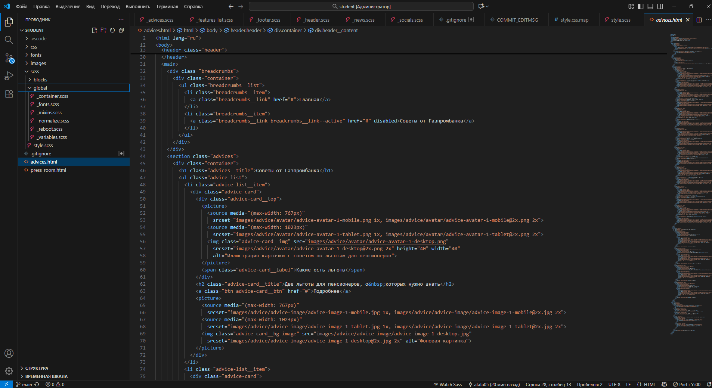
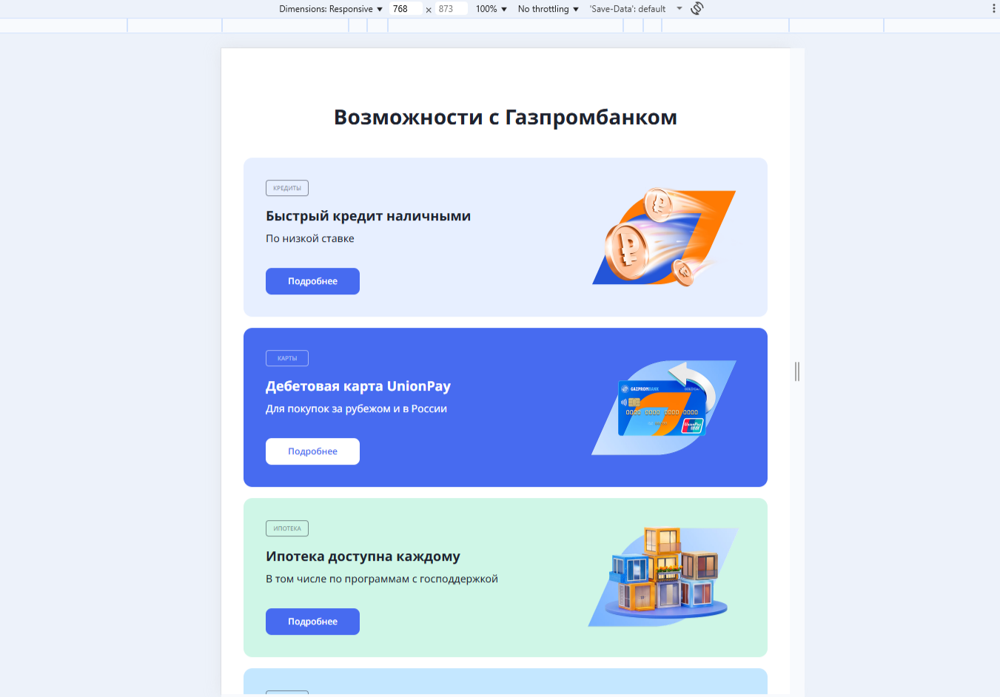
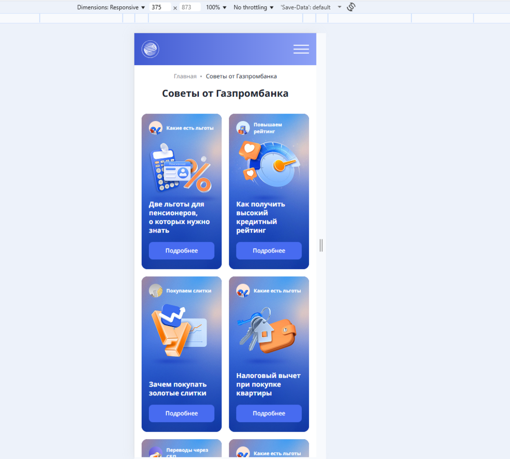

# Adaptive Landing Page

Адаптивная и кроссбраузерная верстка лендинга по макету Figma.

---

## 🔧 Используемые технологии
- HTML5 (семантическая верстка)
- CSS3
- SCSS
- БЭМ-методология
- Flexbox, Grid

---

## 📱 Адаптивность
- Desktop — 1440px
- Tablet — 768px
- Mobile — 375px

---

## 🌐 Кроссбраузерность
- Chrome
- Firefox
- Safari

---

## 🔗 Демо
https://afafa05.github.io/adaptive-landing/

## 📸 Скриншоты

### Desktop

### Tablet

### Mobile

